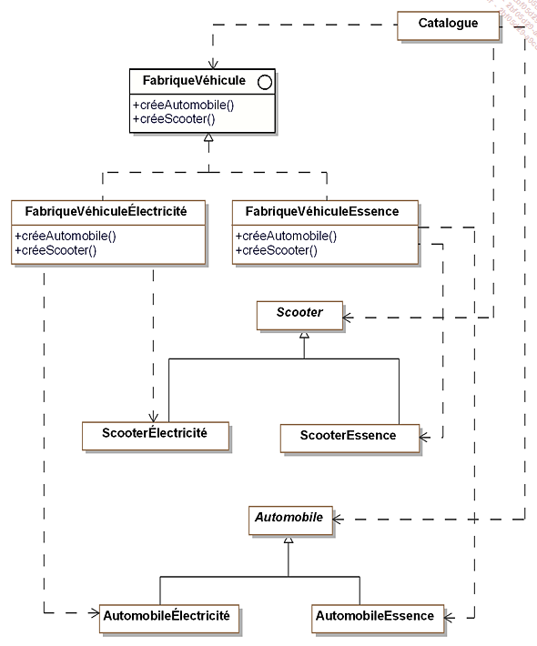
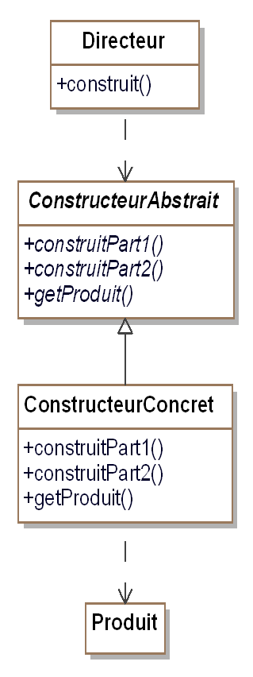
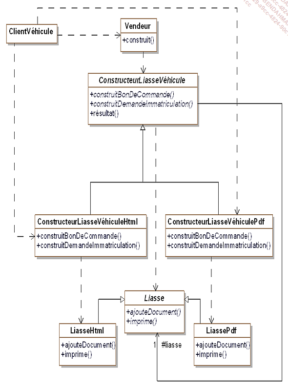

					Design pattern

1.	Définition : Les design patterns permettent de répondre à un problème de programmation connu avec une solution optimal.  Ils répondes a des problèmes de conception en POO. Ils résultent de bonne méthode de programmation.

Prérequis : Base solide en POO, base en c Sharp.

I.	Pattern de construction

L’Abstract factorie, permet de déresponsabilisé la classe mère. Elle permet de pouvoir modifier un comportement sans modifier la classe mère.

Exemple projet catalogue véhicule : L’interface va contenir la signature des méthodes (createElectricVehicle, createThermiqueVehicle, createHybrideVehicle)

Les classes FabriquesVehiculeÉlectricité et FabriqueVéhiculeEssence Implémente une méthode permettant de créer un scooter selon son type (Électricité ou Essence). Ces scooteurs Essence et Électrique hérite d’une classe mère Scooter. (Remarque, ce n’est jamais la classe mère qui est créer mais les classes filles qui héritent de la classe mère).

produit abstrait correspond au scooter

Pattern builder: 

Le vendeur peut créer des bons de commandes sans connaitre la nature des sous classe de constructeurliassevehicle.
Le vendeur va dialoguer que avec le buildeur de base qui est abstrait.

II.	Pattern de structuration

III.	Pattern de comportement
